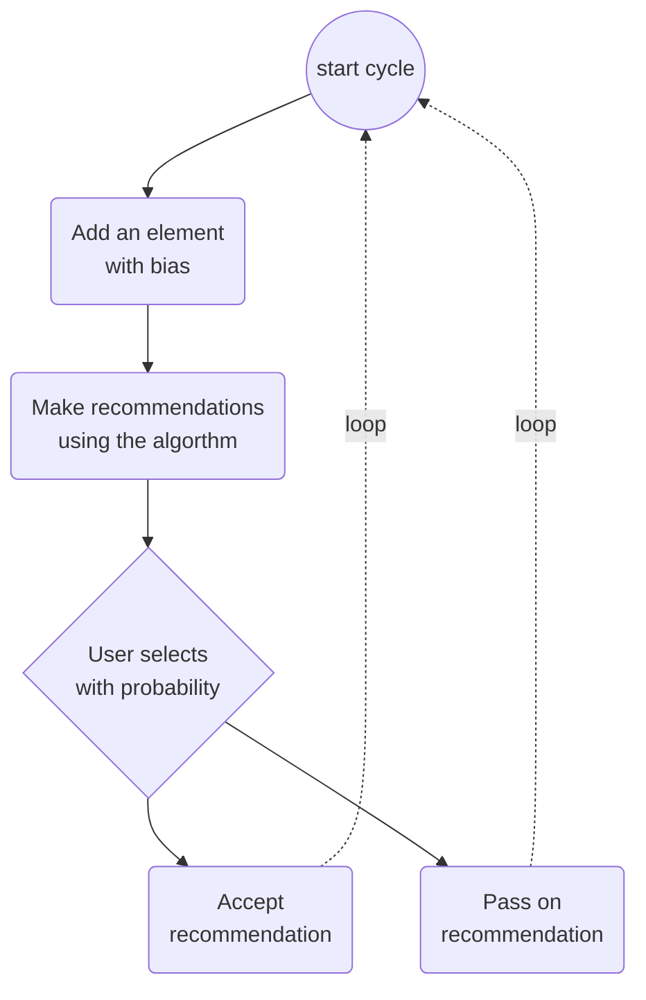

# Simulator

When we have at least one selection, we recommend others according to some algorithm based on similarity.

The actor can ignore, accept or actively reject any of these

To model preference, there is built-in aversion and attraction. The red corner is avoided, green is more actively sought, and blue is neutral. This only applies to NEW selections made using the Add Biased button: Cycle mode always uses the biased add. This can be used to verify that the recommendations evolve approriately in relation to the biased field of selections.

In the evolution, we would expect the actor to gradually explore most of the green area, some of the blue area and less of the red area. We would also want out recommendations to be somewhat matching this pattern over time.

The prior recommendations leave a trace, so that it is possible to read the pattern of multiple recommendations: the darke the gray, the more frequently that recommendation has been made - we would prefer more recommendations rather than more repeats.

Currently two scenarios are available.

## How to Launch

Load from the project folder into vscode.

Terminal -> `env\scripts\activate`
(If the environemnt gets broken, delete the files in Lib\site-packages and use `python3 -m venv env`
then use `python3 -m pip install --force-reinstall -r requirements.txt`)

- Use the green arrow at upperleft to launch `Python:flask`,
- Ctrl-click the url in the terminal window output,
- Ctrl-C to close.

## How to run

If you are just playing around, the diagnostic panel allows you to single step (or multi-step) manually.
For seriously testing the scenarios
- pick the scenario
- give an appropriate name
- use [New] if needed
- use cycle to step through a single cycle of this:

The images will be saved in a folder relative to the project root `data\<case name>` where the case name is the name from the interface.

Files are named simX00Y.png where X is incremented with each New, and Y is incremented with each cycle.
